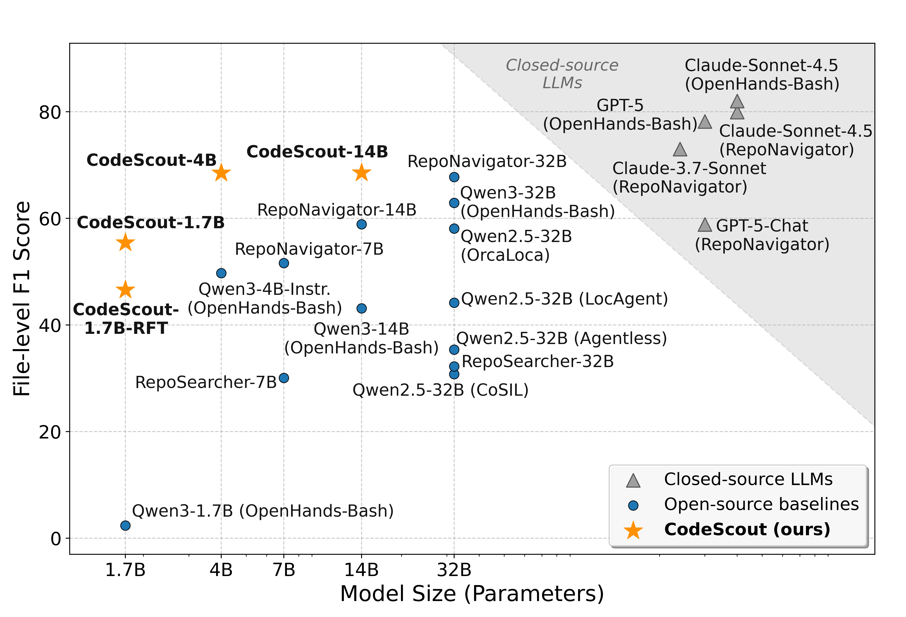
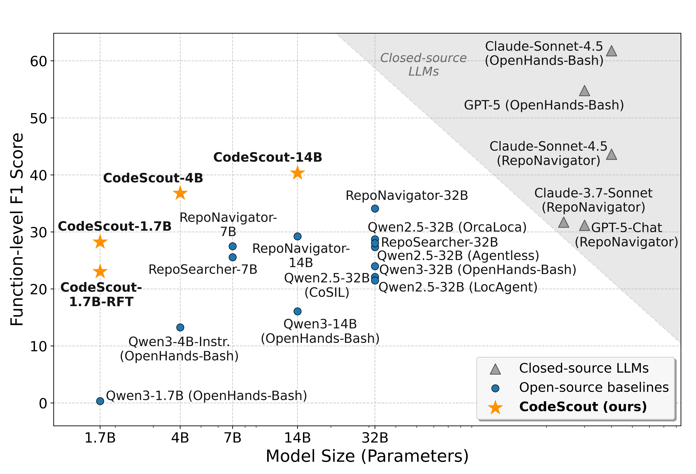
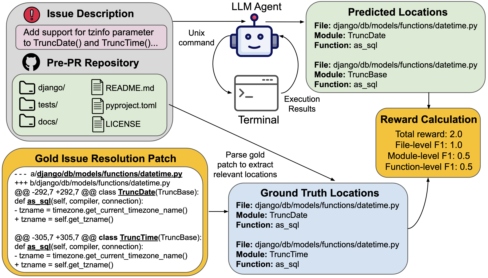

<h1 align="center"> CodeScout: An Effective Recipe for Reinforcement Learning of Code Search Agents</h1>

<p align="center">
	<a href="https://arxiv.org/abs/2603.17829">
		
	</a>
	<a href="https://huggingface.co/collections/OpenHands/codescout">
		
	</a>
</p>


This repository contains the source code (training scripts, reward definitions, prompts) for the paper **CodeScout: An Effective Recipe for Reinforcement Learning of Code Search Agents**

🏆 CodeScout achieves open-source SOTA code localization performance outperforming 8-18x larger base and post-trained LLMs and narrows the gap with frontier closed-source models.

<div align="center">
	
	
</div>

---

## ✨ Overview

A prerequisite for coding agents to perform tasks on large repositories is code localization - the identification of relevant files, classes, and functions to work on. While repository-level code localization has been performed using embedding-based retrieval approaches such as vector search, recent work has focused on developing agents to localize relevant code either as a standalone precursor to or interleaved with performing actual work. Most prior methods on agentic code search equip the agent with complex, specialized tools, such as repository graphs derived from static analysis. In this paper, we demonstrate that, with an effective reinforcement learning recipe, a coding agent equipped with *nothing more* than a standard Unix terminal can be trained to achieve strong results. Our experiments on three benchmarks (SWE-Bench Verified, Pro, and Lite) reveal that our models consistently achieve superior or competitive performance over **2-18×** larger base and post-trained LLMs and sometimes approach performance provided by closed models like Claude Sonnet, even when using specialized scaffolds. Our work particularly focuses on techniques for re-purposing existing coding agent environments for code search, reward design, and RL optimization. We release the resulting model family, CodeScout, along with all our code and data.

---
## 🧠 Methodology

Given a GitHub issue and a pre-PR repository, CodeScout navigates the repository via a terminal using Unix command-line utilities (for e.g. `rg`, `sed`, and `cat`.), and localizes relevant files, classes, and functions of code. The ground truth location set is determined by parsing the gold patch that fixes the issue.

We train 1.7B, 4B, and 14B models using RL wherein our reward function is the sum of file-level, module-level, and function-level F1 scores. 



---

## 🤗 Models & Datasets

We open-source all our models, datasets and trajectories in this [Hugging Face collection](https://huggingface.co/collections/OpenHands/codescout)
- Models: [CodeScout-14B](https://huggingface.co/OpenHands/CodeScout-14B), [CodeScout-4B](https://huggingface.co/OpenHands/CodeScout-4B), [CodeScout-1.7B](https://huggingface.co/OpenHands/CodeScout-1.7B), [CodeScout-1.7B-RFT](https://huggingface.co/OpenHands/CodeScout-1.7B-RFT)
- Training datasets (re-purposed for code localization): [SWE-Smith](https://huggingface.co/datasets/OpenHands/SWE-smith-py-code-search), [SWE-Gym](https://huggingface.co/datasets/OpenHands/SWE-Gym-code-search), [SWE-rebench](https://huggingface.co/datasets/OpenHands/SWE-rebench-code-search).
- Evaluation benchmarks (re-purposed for code search): [SWE-Bench Verified](https://huggingface.co/datasets/OpenHands/SWE-bench_Verified-locagent), [SWE-Bench Pro](https://huggingface.co/datasets/OpenHands/SWE-bench_Pro-locagent), [SWE-Bench Lite](https://huggingface.co/datasets/OpenHands/SWE-bench_Lite-locagent)
- Rollouts:
  - [Training Rollouts logged during RL for CodeScout-14B and CodeScout-4B](https://huggingface.co/datasets/OpenHands/CodeScout_Training_Rollouts)
  - [Evaluation Trajectories for all our experiments on 12 models using 3 benchmarks](https://huggingface.co/datasets/OpenHands/CodeScout_Eval_Rollouts) 
---

## 🚀 Quick Start

### Environment setup

#### Pre-requisities:
1. uv: [Installation instructions](https://docs.astral.sh/uv/getting-started/installation/).
2. `ripgrep`: [Installation instructions](https://github.com/burntsushi/ripgrep?tab=readme-ov-file#installation).
   - **Note**: We have used v15.1.0 in our experiments.
   - We have installed ripgrep using cargo:
   ```bash
      # Step 1: Install Rust (if not already installed on the machine)
      curl --proto '=https' --tlsv1.2 -sSf https://sh.rustup.rs | sh
      source $HOME/.cargo/env

      # Step 2: Install ripgrep via cargo
      cargo install ripgrep --version 15.1.0

      # Step 3: Verify if installation completed successfully - this command should execute without errors
      rg --version       
   ```

#### Installing Dependencies:

Training CodeScout models requires access to GPUs. We use 8xH100 GPUs for all our RL runs.
> **IMPORTANT NOTE**: You must ensure that the uv venv is not saved in the repository root since our training backend (SkyRL) uses Ray which copies all the files in this repository to a  during RL.

```bash
export VIRTUAL_ENV=<location where uv virtual environment must be installed>
uv sync --all-extras --active
source $VIRTUAL_ENV/bin/activate
```

### Launch training (example)
The below command assumes access to a 8x GPU node and trains a 4B model using the same hyper-parameter settings as that of CodeScout-4B. Make sure to set your Wandb API Key as an environment variable.

```bash
export WANDB_API_KEY=<your_key>
bash scripts/run_async_training_4b.sh -m Qwen/Qwen3-4B-Instruct-2507 -n 8 -b 8 -c 1 -r Qwen3-4b-custom-finish-tool-gspo -w false -s <path to save checkpoints> -i 4 -t 4 -d ./data/swe_smith/ -o "+generator.reward=configs/reward_config_4b.yaml"

```

Refer to [this README](./README_Training.md) for detailed instructions on reproducing our RL runs.


### 📊 Evaluation Setup

All our evaluation experiments have been performed using this [fork](https://github.com/adityasoni9998/benchmarks/tree/agentic_code_search) of the [OpenHands benchmarks repository](https://github.com/OpenHands/benchmarks). The repository has detailed instructions on reproducing our evaluation results.

---

## 📚 Citation

```bibtex
@misc{sutawika2026codescouteffectiverecipereinforcement,
	title={CodeScout: An Effective Recipe for Reinforcement Learning of Code Search Agents}, 
	author={Lintang Sutawika and Aditya Bharat Soni and Bharath Sriraam R R and Apurva Gandhi and Taha Yassine and Sanidhya Vijayvargiya and Yuchen Li and Xuhui Zhou and Yilin Zhang and Leander Melroy Maben and Graham Neubig},
	year={2026},
	eprint={2603.17829},
	archivePrefix={arXiv},
	primaryClass={cs.SE},
	url={https://arxiv.org/abs/2603.17829}, 
}
```

