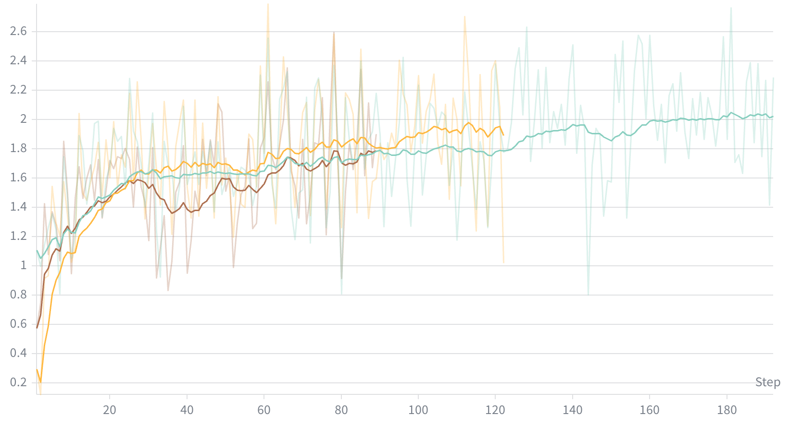

# CodeScout NPU (Ascend 910) 训练指南

## 硬件要求

| 项目 | 要求 |
|------|------|
| NPU | 8 × Ascend 910, 64GB HBM each |
| CANN | 8.3.RC1 (8.3.0.1.200) |
| OS | Ubuntu 22.04 (aarch64) |
| Driver | npu-smi 25.3.rc1 |

## 软件栈

| 组件 | 版本 | 说明 |
|------|------|------|
| Python | 3.12 | openhands-sdk ≥1.7 要求 `>=3.12` |
| torch | 2.8.0+cpu | 匹配 torch_npu；必须用 `--no-deps` 安装 |
| torch_npu | 2.8.0.post2 | CANN 8.3 下支持 Python 3.12 的版本（post2 起提供 cp312 wheel） |
| vllm | 0.11.0 | `--no-deps` |
| vllm-ascend | 0.11.0rc1 (源码构建) | PyPI 版本 pin torch 2.7，需源码构建适配 2.8 |
| ray | 2.51.1 | |
| transformers | 4.57.6 | |
| SkyRL | codescout-npu 分支 | 已包含所有 NPU 适配 |

完整依赖列表见 `requirements-npu.txt`。

## 快速开始

```bash
# 1. Clone repos
git clone https://github.com/yucc-leon/codescout.git && cd codescout && git checkout npu-ascend-adapt
git clone https://github.com/yucc-leon/SkyRL.git ../SkyRL && cd ../SkyRL && git checkout codescout-npu
cd ../codescout

# 2. 安装环境（自动化脚本，需要 CANN 8.3 已安装）
bash scripts/setup_ascend_env.sh

# 3. 准备 repo 缓存（一次性，需要能访问 GitHub）
#    训练时每次 rollout 需要 clone 目标仓库，预缓存可避免重复网络请求
python scripts/precache_repos.py \
    --data data/swe_smith/train.parquet \
    --cache /path/to/repo_cache

# 4. 启动训练（SP=2, 8x8 配置）
export REPO_CACHE=/path/to/repo_cache
bash scripts/run_async_training_npu_sp2.sh \
  -m /path/to/Qwen3-4B-Instruct-2507 \
  -d ./data/swe_smith \
  -s /path/to/ckpts \
  -r my-run-name
```

> **⚠️ 如果你打算使用 NPU 运行此任务，不要使用原项目的 `uv sync` / `pyproject.toml`**：上游依赖安装会拉取 CUDA 版本的 torch 和上游 SkyRL。NPU 环境必须使用 `setup_ascend_env.sh` 或手动安装（`--no-deps`）。

## 参考曲线
multi-level loc reward：

蓝色线为 H200 上运行结果，黄色/棕色为昇腾 910 上结果，精度基本一致

## 训练配置

推荐配置（已验证精度对齐原代码的 H 卡配置）：

| 参数 | 值 | 说明 |
|------|-----|------|
| sequence_parallel_size | 2 | 解决 64GB 显存下长序列 OOM |
| flash_attn | true | SP=2 依赖 FA2 路径 |
| use_sample_packing | true | SP=2 依赖 packing |
| train_batch_size | 8 | |
| n_samples_per_prompt | 8 | 每个 prompt 8 个 rollout |
| max_model_len | 40960 | vLLM 推理最大长度 |
| max_generate_length | 8192 | 单次生成最大长度 |
| temperature | 1.0 | |
| lr | 1e-6 | |
| policy_loss_type | gspo | |
| eps_clip_low/high | 0.0003/0.0004 | GSPO clip range |

## Repo 缓存

RL 训练的每次 rollout 需要 `git clone` 目标仓库。如果训练环境直连 GitHub 不通畅，会导致 clone 过程阻碍训练

解决方案：预先将训练数据涉及的 repo 以 bare repo 形式缓存到共享存储。

```bash
# 在能直连 GitHub 的机器上执行一次（swe_smith: 131 repos, ~10-15 GB）
python scripts/precache_repos.py \
    --data data/swe_smith/train.parquet \
    --cache /path/to/repo_cache
```

训练时设置 `REPO_CACHE` 环境变量指向缓存目录：

```bash
export REPO_CACHE=/path/to/repo_cache
bash scripts/run_async_training_npu_sp2.sh \
  -m /path/to/model -d ./data/swe_smith -s /path/to/ckpts -r my-run
```

`clone_instance` 会自动优先从本地缓存 clone（秒级），失败时 fallback 到 GitHub。


## vllm-ascend 源码构建

PyPI 上的 vllm-ascend 0.11.0rc1 的 build-requires 写死了 torch==2.7.1，需要从源码构建以兼容 torch 2.8：

```bash
git clone --depth 1 --branch v0.11.0rc1 \
  https://github.com/vllm-project/vllm-ascend.git /tmp/vllm-ascend-src

# 修改版本约束
sed -i 's/"torch-npu==2.7.1"/"torch-npu==2.8.0.post2"/' /tmp/vllm-ascend-src/pyproject.toml
sed -i 's/"torch==2.7.1"/"torch==2.8.0"/' /tmp/vllm-ascend-src/pyproject.toml
sed -i 's/"numpy<2.0.0"/"numpy"/' /tmp/vllm-ascend-src/pyproject.toml
sed -i 's/VERSION_EQUAL "2.7.1"/VERSION_EQUAL "2.8.0"/' /tmp/vllm-ascend-src/CMakeLists.txt

# 构建
TORCH_DEVICE_BACKEND_AUTOLOAD=0 pip install /tmp/vllm-ascend-src/ --no-deps --no-build-isolation
```

`setup_ascend_env.sh` 已包含此步骤。

## 常见问题

### 环境搭建

**vllm-ascend 构建失败：`python3: not found`**
容器里可能没有 `python3`。确保 conda 环境的 bin 目录在 PATH 中：
```bash
export PATH="$CONDA_ENV/bin:$PATH"
```

**vllm-ascend 构建失败：`No module named 'pybind11'`**
构建依赖需要预装：
```bash
pip install numpy pybind11 setuptools_scm cmake typing_extensions "setuptools<76" pyyaml
```

**git clone 通过 HTTP 代理失败：`Proxy CONNECT aborted`**
Ubuntu 默认 git 使用 GnuTLS，与某些 HTTP 代理不兼容。用 `curl` 下载 tarball 代替 `git clone`。

**pip 安装拉到错误的 transformers 版本**
使用 `requirements-npu.txt` 锁定所有依赖版本：
```bash
pip install -r requirements-npu.txt
```

**torch 版本被覆盖**
`pip install` 不加 `--no-deps` 会拉 CUDA torch 覆盖 torch_npu。所有 torch 相关包必须用 `--no-deps`。

### 代理配置

训练脚本会保留已有的代理设置（`http_proxy` 等），并通过 `no_proxy` 排除本地地址（vLLM endpoint）。代理变量会被自动转发给 Ray worker。

如果集群不需要代理，无需额外配置。


### 训练运行时

**长序列显存 OOM**
64GB HBM 下，`lm_head` 的 logits tensor `(B, S, V)` 在 glen > 34K 时约 11 GB，可能 OOM。使用 SP=2（`run_async_training_npu_sp2.sh` 已默认启用）。

**NPU 僵尸进程**
训练中断后 vLLM/Ray 进程可能残留。训练前运行：
```bash
ray stop --force
pkill -9 -f "vllm\|ray\|FSDP"
```

**litellm 版本**
锁定 litellm==1.82.6，不要升级。

## 训练效果

SP=2 配置在 Ascend 910 (8×64GB) 上的 `multilevel_localization_f1_reward` 曲线与 H200 基本对齐（step 50 时约 1.7）。

每步耗时约 3-5 分钟（rollout + training），其中 rollout 占大部分时间。


## 附录：NPU 适配技术细节

以下内容供了解适配原理参考。直接使用 `codescout-npu` 分支的 SkyRL 无需手动操作。

### Flash Attention 适配

昇腾 NPU 不支持 CUDA flash_attn 库。训练配置中 `flash_attn=true` + `use_sample_packing=true` 是 SP=2（Ulysses Sequence Parallel）的必要条件，但实际的 attention 计算走的不是 flash_attn，而是经过多层替换后的 NPU 原生实现：

1. `npu_support/patch_cuda.py` 安装 `flash_attn` stub 模块，提供 `unpad_input`/`pad_input` 的纯 PyTorch 实现，使 `from flash_attn.bert_padding import ...` 不会报错
2. `model_wrapper.py` 中 `flash_attn` import 改为 `try/except`，fallback 到 SDPA（`attn_implementation="sdpa"`）
3. SkyRL 的 Ulysses monkey-patch 替换 transformers 的 `_flash_attention_forward`，插入 all-to-all 通信实现序列并行
4. 实际 attention kernel 由 `torch.nn.functional.scaled_dot_product_attention` 执行，torch_npu 会自动 dispatch 到昇腾的融合 attention 算子

简言之：配置写 `flash_attn=true` 是为了激活 SkyRL 的 FA2 代码路径（SP 依赖），但底层计算由 NPU SDPA 完成。

### Monkey-Patch (`npu_support/patch_cuda.py`)

通过 `.pth` 文件在 Python 启动时自动加载：
- `torch.cuda` → `torch.npu` 模块级代理
- `init_device_mesh("cuda")` → `"npu"`
- `ray.remote(num_gpus=N)` → `resources={"NPU": N}`
- `init_process_group(backend="nccl")` → `"hccl"`
- `flash_attn` stub（提供 `unpad_input`/`pad_input` 的纯 PyTorch 实现）
- `torch.autocast(device_type="cuda")` → `"npu"`

安装（`setup_ascend_env.sh` 已包含）：
```bash
SITE=$(python -c "import site; print(site.getsitepackages()[0])")
cp -r SkyRL/npu_support $SITE/npu_support
cp SkyRL/npu_support/npu_autoload.pth $SITE/
```

### 源码 Patch

9 个文件的 `cuda→npu`, `nccl→hccl`, `GPU→NPU` 替换：
```
skyrl-train/skyrl_train/distributed/fsdp_strategy.py
skyrl-train/skyrl_train/distributed/fsdp_utils.py
skyrl-train/skyrl_train/distributed/strategy.py
skyrl-train/skyrl_train/workers/fsdp/fsdp_worker.py
skyrl-train/skyrl_train/workers/worker.py
skyrl-train/skyrl_train/inference_engines/vllm/vllm_engine.py
skyrl-train/skyrl_train/model_wrapper.py (flash_attn import → try/except, eager → sdpa)
skyrl-train/skyrl_train/utils/utils.py (代理/REPO_CACHE 环境变量转发)
skyrl-train/skyrl_train/fully_async_trainer.py (weight sync 可选跳过)
```

`codescout-npu` 分支已包含所有 patch。也可用自动化脚本应用到上游 SkyRL：
```bash
python SkyRL/npu_support/apply_npu_patches.py SkyRL/skyrl-train/skyrl_train
```

### site-packages 补丁

**transformers: continue_final_message 冲突修复**

文件: `transformers/tokenization_utils_base.py`
```python
# 原始:
        if continue_final_message:
            if add_generation_prompt:
                raise ValueError(
# 修改为:
        if continue_final_message:
            add_generation_prompt = False
            if False:
                raise ValueError(
```

**openhands SDK: 双重编码 JSON 防御**

文件: `openhands/sdk/agent/agent.py`
```python
# 在 arguments = json.loads(tool_call.arguments) 后加:
            if isinstance(arguments, str):
                arguments = json.loads(arguments)
```
